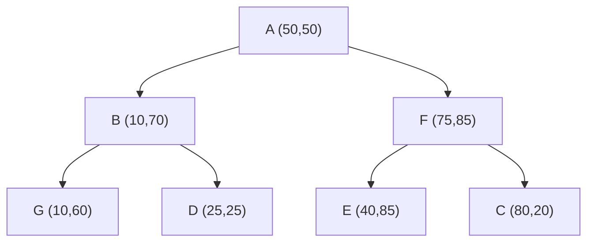

> [!NOTE] ChatGPT
> Vygenerováno pomocí ChatGPT na základě přednášek od Holubove

![[Pasted image 20240823133822.png]]
### K-d Tree: Princip, Výhody a Nevýhody

K-d tree (zkratka pro "k-dimensional tree") je datová struktura používaná k organizaci bodů v k-rozměrném prostoru. Nejčastěji se používá pro dvourozměrné nebo trojrozměrné prostory, ale je aplikovatelný i pro vyšší dimenze. K-d tree je binární strom, kde každý vnitřní uzel reprezentuje rozdělení prostoru podle jedné z dimenzí, přičemž střídání dimenzí je závislé na hloubce uzlu v stromu.

#### Příklad:

Představme si následující body ve 2D prostoru:
- A (50, 50)
- B (10, 70)
- C (80, 20)
- D (25, 25)
- E (40, 85)
- F (75, 85)
- G (10, 60)

Postup konstrukce k-d tree:

1. **Vybereme osu:** Začneme s osou x, rozdělíme body podle hodnoty x na dvě části. V dalším kroku použijeme osu y a tak dále, přičemž se osy střídají.
2. **Rozdělení:** Pro každý uzel stromu vybereme median bodu podle aktuální osy, tento bod umístíme jako kořen uzlu. Levé podstromy obsahují body s nižšími hodnotami než median, pravé s vyššími.

#### Kresba k-d tree pomocí mermaid:

### Výhody a Nevýhody k-d Tree

#### Výhody:
1. **Rychlé vyhledávání:** K-d tree umožňuje rychlé vyhledávání bodů ve více dimenzích. Pro bodové dotazy je efektivita vyhledávání \(O(\log n)\).
2. **Efektivní prostorové dělení:** Efektivně rozděluje prostor, což umožňuje rychlé zpracování rozsahových dotazů a nejbližších sousedů.
3. **Flexibilita:** Lze aplikovat na různé dimenze (2D, 3D atd.), což činí k-d tree univerzálním nástrojem pro práci s vícerozměrnými daty.

#### Nevýhody:
1. **Nerovnoměrné rozdělení dat:** Pokud jsou data nerovnoměrně rozložena, strom může být velmi nevyvážený, což vede k zhoršení výkonu.
2. **Vysoká paměťová náročnost:** V některých případech může být náročný na paměť, zejména při práci s velkými datovými sadami.
3. **Složitá údržba:** Vkládání a mazání bodů může vyžadovat rozsáhlé úpravy stromu, což činí údržbu náročnou.

### Shrnutí

K-d tree je výkonná datová struktura pro vícerozměrné vyhledávání, která umožňuje efektivní rozdělení prostoru a rychlé vyhledávání bodů. Nicméně, jako každá datová struktura, má i své nevýhody, zejména pokud jde o nevyvážená data nebo složitou údržbu. Je to obzvláště užitečný nástroj v aplikacích jako jsou geografické informační systémy nebo strojové učení, kde je třeba pracovat s více dimenzemi.