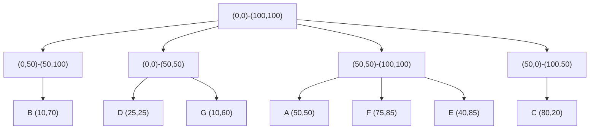

> [!NOTE] ChatGPT
> Vygenerováno pomocí ChatGPT na základě přednášek od Holubovy

> [!Danger] Stromy
> Stromy jsou vygenerovane a mohou byt spatne, jeste jsem je neupravil.

### Příklad Quad-tree a jeho vysvětlení
![[Pasted image 20240823133553.png]]
**Quad-tree** je datová struktura používaná pro reprezentaci dvourozměrného prostoru. Princip spočívá v rekurzivním rozdělování prostoru na čtyři kvadranty, což je užitečné pro ukládání a vyhledávání vícerozměrných dat, zejména v geografických informačních systémech nebo při práci s obrazovými daty.

#### Příklad:

Představme si, že máme následující body v 2D prostoru:
- A (50, 50)
- B (10, 70)
- C (80, 20)
- D (25, 25)
- E (40, 85)
- F (75, 85)
- G (10, 60)

Pro vytvoření Quad-tree bychom postupovali takto:

1. **Rozdělení prostoru**: Celý prostor rozdělíme na čtyři kvadranty, přičemž každý kvadrant může být opět rozdělen, pokud obsahuje více bodů.

2. **Rekurze**: Proces rekurzivně pokračuje v každém kvadrantu, dokud nejsou všechny body správně zařazeny do svého příslušného regionu.

Nyní ukážeme, jak by Quad-tree mohl vypadat pro uvedené body.

#### Kresba Quad-tree pomocí mermaid:

### Výhody a nevýhody Quad-tree

#### Výhody:
1. **Efektivní prostorová lokalita**: Quad-tree udržuje prostorovou lokalitu, což znamená, že body blízko sebe v prostoru jsou často blízko sebe i ve struktuře stromu.
2. **Flexibilita**: Může být aplikován na různé druhy dvourozměrných dat, včetně bodů, linií, a oblastí.
3. **Snadná implementace**: Struktura Quad-tree je poměrně jednoduchá na implementaci a je dobře přizpůsobená pro použití s geometrickými daty.

#### Nevýhody:
1. **Nerovnoměrná vyváženost**: Quad-tree může být nevyvážený, pokud jsou data nerovnoměrně rozložena, což může vést k vysokým časům vyhledávání v určitých oblastech.
2. **Rozsáhlá paměťová náročnost**: Pokud je strom hluboký, může vyžadovat velké množství paměti, zvláště pokud je prostor vysoce rozdělený.
3. **Neschopnost dobře pracovat s dynamickými daty**: Quad-tree může být méně efektivní, pokud se data často mění nebo přidávají, což vede k častým aktualizacím stromu.

Tato datová struktura je tedy výbornou volbou pro pevně dané datové sady nebo pro systémy, kde prostorová lokalita hraje klíčovou roli, ale je třeba zvážit její nevýhody při práci s dynamickými nebo velmi nerovnoměrně rozloženými daty.