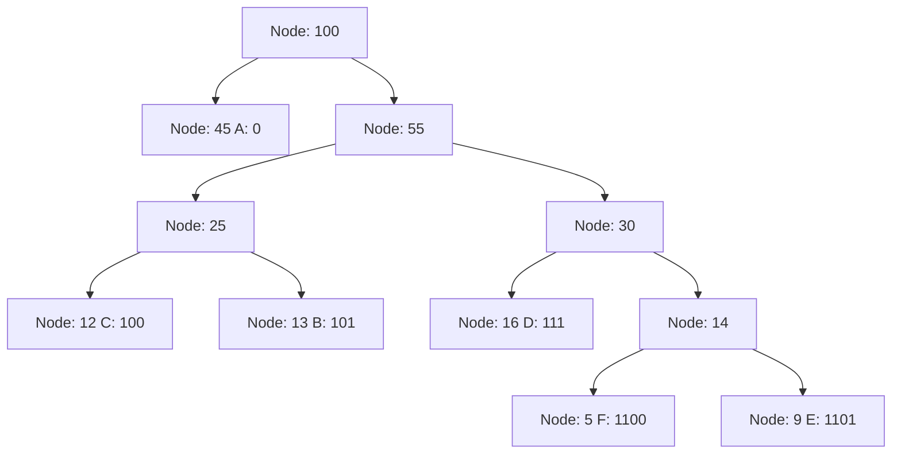

> [!NOTE] ChatGPT
> Vygenerováno pomocí ChatGPT na základě poznamek.

> [!DANGER] Priklady
> Priklady jsou generovany, jejich spravnost nemusi byt 100%

Různé algoritmy pro kompresi dat se liší v přístupu, jakým snižují velikost dat, ale všechny mají společný cíl: minimalizovat počet bitů potřebných pro reprezentaci dat. Níže jsou uvedeny základní myšlenky a příklady pro čtyři hlavní algoritmy komprese: Run-Length Encoding (RLE), Huffman Coding, Lempel-Ziv-Welch (LZW) a Arithmetic Coding.

# **Run-Length Encoding (RLE)**

## Základní myšlenka:
- Run-Length Encoding (RLE) je jednoduchý algoritmus, který komprimuje data tím, že nahrazuje sekvence opakujících se znaků (běh) jediným znakem následovaným počtem opakování tohoto znaku.
- Tento algoritmus je zvláště účinný pro kompresi dat, která obsahují dlouhé sekvence stejných hodnot, jako jsou bitmapové obrázky s velkými plochami jedné barvy.

### Příklad:
- Představte si řetězec: **"AAAAABBBCCDAA"**.
- Pomocí RLE je tento řetězec zkomprimován na: **"5A3B2C1D2A"**.
- V tomto příkladu je 'A' opakováno 5krát, 'B' 3krát, 'C' 2krát, 'D' 1krát a 'A' 2krát.

## Výhoda:
- Velmi jednoduchá a rychlá implementace.
- Efektivní pro data s dlouhými běhy opakujících se znaků.

## Nevýhoda:
- Méně efektivní pro data s vysokou variabilitou nebo bez opakujících se sekvencí.

# 2. **Huffman Coding**

## Základní myšlenka:
- Huffmanovo kódování je bezeztrátový kompresní algoritmus, který využívá frekvenci výskytu jednotlivých znaků v datovém souboru k vytvoření optimálního binárního kódu.
- Znaky, které se vyskytují častěji, jsou reprezentovány kratšími binárními kódy, zatímco méně časté znaky dostávají delší kódy.

### Příklad:
- Představte si následující znaky s jejich frekvencemi: A (45), B (13), C (12), D (16), E (9), F (5).
- Huffmanovo kódování vytvoří strom, kde každý list představuje znak a cesta od kořene ke znaku definuje jeho binární kód.
- Možné kódování může vypadat takto:
  - A: 0
  - B: 101
  - C: 100
  - D: 111
  - E: 1101
  - F: 1100
- Tento kód je optimální v tom smyslu, že minimalizuje celkovou délku komprimovaného datového souboru.

## Výhoda:
- Vytváří optimální kód pro danou frekvenci výskytu znaků.
- Efektivní pro textové soubory a jiné datové formáty s různou četností symbolů.

## Nevýhoda:
- Algoritmus musí znát frekvence znaků předem nebo je muset zjistit.

# **Lempel-Ziv-Welch (LZW)**

## Základní myšlenka:
- LZW je bezeztrátový kompresní algoritmus, který komprimuje data identifikací opakujících se vzorů (sekvencí) v datech a jejich nahrazením odkazy na dříve nalezené sekvence.
- Tento algoritmus nevyžaduje žádnou předchozí znalost pravděpodobnostních modelů.

### Příklad:
- Představme si řetězec: **"ABABABABA"**.
- LZW vytvoří slovník, který začíná jednotlivými znaky:
  - A: 1, B: 2.
  - Jakmile narazí na první "AB", přidá do slovníku nový záznam "AB" s kódem 3.
  - Při dalším výskytu "AB" použije kód 3 místo znovu "AB".
  - Konečný výstup může vypadat jako: **1 2 3 3 3 1**, kde každé číslo odpovídá kódu ve slovníku.
![[Pasted image 20240825134632.png]]
## Výhoda:
- Velmi efektivní pro kompresi opakujících se vzorů v datech, jako jsou soubory s textem nebo grafické formáty.
- Algoritmus je rychlý a má široké využití (např. ve formátech GIF).

## Nevýhoda:
- Pro data s málo opakujícími se vzory může být méně efektivní.

# **Arithmetic Coding**

## Základní myšlenka:
- Aritmetické kódování je pokročilý kompresní algoritmus, který kóduje celé zprávy jako jedno reálné číslo v intervalu \[0, 1), na základě pravděpodobností jednotlivých symbolů.
- Na rozdíl od Huffmanova kódování, které přiřazuje pevné binární kódy jednotlivým znakům, aritmetické kódování přistupuje ke kódování zprávy jako celku.

### Příklad:
- Představme si zprávu "AAB", kde symboly A, B mají pravděpodobnosti 0.6 a 0.4.
- Aritmetické kódování rozdělí interval \[0, 1) na segmenty odpovídající pravděpodobnostem:
  - "A" zabírá interval \[0, 0.6), "B" zabírá \[0.6, 1).
- Při čtení zprávy se každý symbol zužuje na menší segment:
  - Po přečtení "A" bude interval \[0, 0.6).
  - Po druhém "A" se interval zúží na \[0, 0.36).
  - Po "B" se výsledný interval zúží na \[0.216, 0.36).
- Výsledné číslo, které představuje celou zprávu, bude jedno z intervalu \[0.216, 0.36).

## Výhoda:
- Velmi blízký optimální kompresi, protože kóduje celou zprávu jako celek.
- Flexibilní a může být použit pro efektivní kompresi i u symbolů s velmi nízkou pravděpodobností.

## Nevýhoda:
- Implementace aritmetického kódování může být složitější a vyžaduje přesnou aritmetiku.

### Shrnutí

Každý z uvedených algoritmů má své specifické výhody a je vhodný pro různé typy dat:

- **RLE** je nejlepší pro data s dlouhými sekvencemi opakujících se znaků.
- **Huffmanovo kódování** je efektivní pro texty a data s různou frekvencí symbolů.
- **LZW** dobře funguje na opakujících se vzorech, například v textových nebo grafických souborech.
- **Aritmetické kódování** poskytuje téměř optimální kompresi pro jakýkoliv typ dat, ale je složitější na implementaci.

Každý algoritmus si najde své využití v závislosti na povaze a struktuře dat, která potřebujeme komprimovat.
