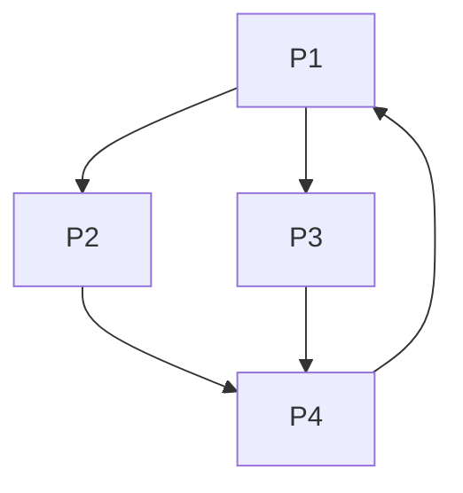

---
tags:
  - databaze_a_web
  - tomas
  - web
dg-publish: true
---
> [!TODO] Pridat odkaz na prezentaci

> [!NOTE] ChatGPT
> Vygenerováno pomocí ChatGPT na základě přednášek z Vyhledávání na webu.

Vyhledávání v hypertextu, což je základní struktura webu, představuje <mark style="background: #FFF3A3A6;">řadu výzev</mark> a příležitostí vzhledem k propojenosti a dynamice webových stránek. Abychom lépe pochopili a efektivně vyhledávali v této síti propojených dokumentů, používáme různé metody pro hodnocení a řazení stránek. Jednou z nejznámějších metod je **PageRank**, kterou vyvinuli Sergey Brin a Larry Page, zakladatelé Googlu.

#### 1. Hypertextová Struktura Webu
Web lze modelovat jako **graf**, kde:
- **Uzly** reprezentují webové stránky.
- **Orientační hrany** reprezentují hypertextové odkazy mezi těmito stránkami.

Tento **webový graf** je bohatý na strukturu a informace, protože odkazy mezi stránkami poskytují nejen navigační, ale i <mark style="background: #FFF3A3A6;">sémantické vodítka</mark>. Stránky mohou být analyzovány na základě počtu odchozích (outlinks) a příchozích (inlinks) odkazů:
- **Huby**: Stránky s mnoha odchozími odkazy.
- **Autority**: Stránky s mnoha příchozími odkazy.

##### Příklad Webového Grafu:

Tento graf zobrazuje propojení mezi čtyřmi stránkami (P1, P2, P3, P4).

#### 2. Ranking Stránek
Ranking stránek je proces přiřazení číselné hodnoty, která reprezentuje „důležitost“ nebo „relevanci“ stránky v kontextu dané dotazové sady. Tento proces zahrnuje kombinaci různých faktorů, jako je obsahová relevance a struktura odkazů.

##### 2.1 PageRank
**PageRank** je algoritmus vyvinutý k hodnocení webových stránek na základě analýzy webového grafu. Je založen na následující myšlence:
- **„Webová stránka je důležitá, pokud na ni odkazují jiné důležité stránky.“**

Tato myšlenka je sice kruhová, ale je dobře <mark style="background: #FFF3A3A6;">formalizovatelná</mark>. PageRank lze vypočítat iterativním procesem, který vychází z následující rovnice:

$$
r(P_i) = \sum_{P_j \in B_{P_i}} \frac{r(P_j)}{|P_j|}
$$

kde:
- $r(P_i)$ je PageRank stránky $P_i$.
- $B_{P_i}$ je množina stránek, které odkazují na stránku $P_i$.
- $|P_j|$ je počet odchozích odkazů stránky $P_j$.

##### 2.2 Iterativní Výpočet
Výpočet PageRank se provádí <mark style="background: #FFF3A3A6;">iterativně</mark>. Nejprve se PageRank všech stránek <mark style="background: #FFF3A3A6;">inicializuje</mark> na stejnou hodnotu (např. $1/n$, kde $n$ je počet všech stránek), a poté se iterativně aktualizuje podle [[#2.1 PageRank|výše uvedené rovnice.]]

Iterace probíhají, dokud se hodnoty PageRank nestabilizují (konvergují). Konečná hodnota PageRank pro každou stránku poskytuje míru její důležitosti v rámci celého webového grafu.

##### Příklad Adjacenční Matice:

Odpovídající adjacenční matice (H) pro výše uvedený graf:

$$
H = \begin{pmatrix}
0 & 1/2 & 1/2 & 0 \\
0 & 0 & 0 & 1 \\
0 & 0 & 0 & 1 \\
1 & 0 & 0 & 0 \\
\end{pmatrix}
$$

##### 2.3 Modifikace Algoritmu
Původní PageRank algoritmus má určité problémy, jako jsou **cykly** nebo **sifony hodnocení**, kde některé stránky akumulují veškerý rank. Tento problém byl vyřešen modifikací na tzv. **Google Matrix**, který je stochastický, ireducibilní a aperiodický. Tato modifikace zahrnuje **teleportační mechanismus**, kde se uživatel „náhodně“ přemisťuje na jakoukoliv stránku s určitou pravděpodobností.

Výsledná rovnice pro výpočet PageRank je:

$$
G = \alpha S + (1 - \alpha) \frac{(1-\alpha)}{n} \times ee^T
$$

kde $\alpha$ je teleportační faktor (často 0,85).