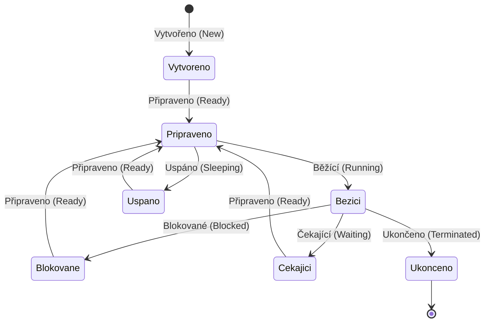

Plánování běhu procesů a vláken (scheduling) je jedním z klíčových úkolů operačního systému. Jeho úkolem je rozhodnout, který proces nebo vlákno by mělo být v daném okamžiku přiděleno k běhu na procesoru. Existují různé metody plánování, které mohou být použity v závislosti na požadavcích a vlastnostech systému.

> [!NOTE] ChatGPT
> Vygenerováno pomocí ChatGPT

#### 1. **Plánování procesů**

Procesy jsou samostatné jednotky, které obsahují svůj vlastní adresní prostor a vykonávají určité úkoly. Každý proces může obsahovat jedno nebo více vláken.

- **Plánovací algoritmy pro procesy**:
  - **FIFO (First In, First Out)**: Procesy jsou zpracovávány v pořadí, ve kterém byly vytvořeny.
  - **SJF (Shortest Job First)**: Upřednostňuje procesy s nejkratší dobou trvání.
  - **Round Robin**: Každému procesu je přiděleno určité časové kvantum, po jehož uplynutí se přepne na další proces.
  - **Priority Scheduling**: Procesy jsou plánovány na základě jejich priorit, přičemž procesy s vyšší prioritou jsou upřednostněny.

#### 2. **Plánování vláken**

Vlákna (threads) jsou lehčí jednotky uvnitř procesu. Sdílejí stejný adresní prostor, což umožňuje rychlejší komunikaci mezi nimi, ale na druhou stranu mohou být také náchylnější k chybám, jako jsou race conditions.

- **Plánovací algoritmy pro vlákna**:
  - **Preemptivní plánování**: Vlákna mohou být přerušena operačním systémem, aby bylo umožněno jinému vláknu běžet.
  - **Kooperativní plánování**: Vlákna musí dobrovolně uvolnit CPU pro jiná vlákna, podobně jako u kooperativního multitaskingu.

#### 3. **Stavy vlákna (a i procesů?)**

Vlákna mohou během svého životního cyklu procházet několika stavy:

1. **Vytvořeno (New)**: Vlákno bylo vytvořeno, ale dosud nezačalo běžet.
2. **Běžící (Running)**: Vlákno je aktuálně vykonáváno procesorem.
3. **Blokované (Blocked)**: Vlákno čeká na splnění určité podmínky, například na dokončení I/O operace, aby mohlo pokračovat.
4. **Čekající (Waiting)**: Vlákno čeká na nějakou událost, jako je uvolnění zámku nebo signál od jiného vlákna.
5. **Uspáno (Sleeping)**: Vlákno je dočasně pozastaveno na určitou dobu.
6. **Připraveno (Ready)**: Vlákno je připraveno běžet, jakmile bude přiděleno CPU, ale momentálně neběží, protože CPU je zaneprázdněno jiným vláknem.
7. **Ukončeno (Terminated)**: Vlákno dokončilo svou činnost a již není aktivní.

### Příklady z praxe

- **Round Robin v plánování procesů**: V systému Linux je Round Robin běžně používán pro plánování procesů v prostředí, kde všechny procesy mají podobnou důležitost. Procesy dostávají určité časové kvantum (např. 100 ms), po jehož uplynutí je proces přerušen a další proces dostane příležitost běžet.

- **Preemptivní plánování vláken**: V moderním operačním systému, jako je Windows nebo Linux, mohou vlákna jednoho procesu být přerušena operačním systémem, aby byla dána příležitost jinému vláknu, například pokud toto nové vlákno obdrželo vyšší prioritu, nebo uplynulo přidělené časové kvantum.

- **Blokovaný stav vlákna**: Představte si vlákno, které čte data ze souboru. Dokud nebudou data dostupná (např. dokud nebude soubor přečten), vlákno se nachází ve stavu blokovaném. Jakmile jsou data k dispozici, vlákno přejde do stavu připraveno a následně běžící, jakmile dostane přidělený čas procesoru.

